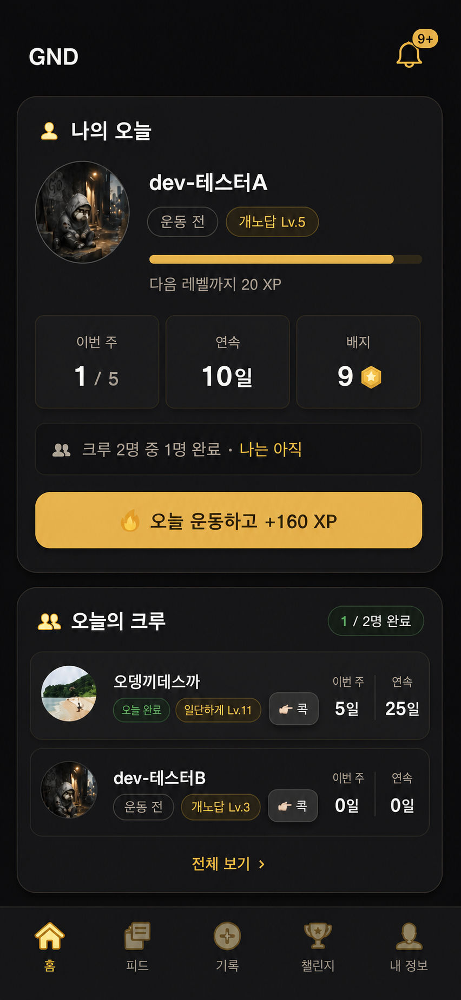

# 홈 내 상태·크루 경쟁 보드 설계

- 날짜: 2026-08-21
- 상태: 목업 방향 사용자 승인, 구현 전 설계 검토
- 범위: 홈 상단 정보 구조와 표시 컴포넌트
- DB·마이그레이션: 없음

## 1. 목적

홈에 들어온 사용자가 3초 안에 아래 세 가지를 이해하게 한다.

1. 나는 오늘 운동했는가.
2. 크루는 오늘 얼마나 움직였는가.
3. 지금 무엇을 누르면 격차를 줄일 수 있는가.

경쟁심은 등수나 자극적인 문구가 아니라 **같은 기간·같은 기준의 상태를 동시에
비교**할 때 생기게 한다. 가독성을 해치는 누적 수치와 중복 위젯은 홈 상단에서
제거하되, 상세 프로필에서 확인할 수 있는 과거 기록과 배지는 유지한다.

## 2. 현재 상태와 문제

2026-08-21 개발 서버의 390×844 화면에서 확인한 현행 구조는 다음과 같다.

- 첫 카드 `나의 크루 2명` 안에 내 행과 크루 행이 함께 있다.
- 첫 카드 높이는 약 589px라 첫 화면 대부분을 차지한다.
- 내 성장, 스트릭, 주간 통계는 챌린지 카드 아래로 밀린다.
- 내 행과 크루 행에는 오늘 상태·누적 운동 횟수·누적 시간·연속일·배지가 표시된다.
- 크루원의 프로필 영역을 누르면 `MemberProfileSheet`가 열린다.
- `👉 콕`은 프로필 버튼의 형제 버튼으로 존재한다.

문제는 데이터 부족이 아니라 정보의 우선순위다. 내 현재 상태는 크루 카드 안의 한
행으로 축소돼 있고, 성장·스트릭·주간 상태는 서로 다른 카드에 반복된다. 반대로
오늘 경쟁에 덜 중요한 누적 운동 횟수와 누적 시간은 첫 화면의 큰 면적을 차지한다.

## 3. 검토한 안

### A. 독립 내 카드 + 바로 아래 오늘의 크루 — 채택

내 카드를 최상단에 분리하고 크루 카드를 바로 붙인다. 카드 경계는 분명하지만 하나의
비교 구역처럼 읽힌다. 내 카드에 오늘 행동 버튼을 둬 비교 직후 바로 운동할 수 있다.

### B. 첨부 시안의 모든 블록을 내 카드에 통합 — 기각

성장 진행, 7일 점, 스트릭 경고, 주간 달성률을 모두 유지하면 내 카드만으로 첫 화면을
소진한다. 크루가 접힘선 아래로 내려가므로 경쟁 목적과 충돌한다.

### C. 기존 크루 카드에서 내 행만 더 강조 — 기각

구현량은 작지만 내 프로필을 분리한다는 요구를 충족하지 못하고, 내 상태가 계속 크루
목록의 한 행으로 읽힌다.

## 4. 승인 목업

목업은 방향과 정보 위계를 확정하기 위한 구조 참고다. 2026-08-21 전문가 재검토에서
아래 네 가지를 보완안으로 승인했다.

1. ~~내 카드의 배지 타일 제거~~ → **철회. 배지 개수 칸을 되살린다** (아래 참조)
2. ~~크루 헤더의 `1 / 2명 완료` 중복 칩 제거~~ → **철회. 칩을 되살린다** (아래 참조)
3. 운동 전 비활성 `콕`의 이유를 한 줄로 표시 — 유지
4. 내 카드·크루 행에 실제 높이 제한 적용 — 유지

### 2026-08-21 구현 중 사용자 지시로 뒤집힌 것

구현 화면을 보고 사용자가 직접 세 가지를 확정했다. **이 절이 위 1·2번보다 나중이고,
따라서 우선한다.**

| # | 지시 | 결과 |
|---|---|---|
| A | "배지 항목이 빠져 있네" | 내 카드에 **배지 개수 칸을 되살린다.** 지표가 2칸 → 3칸(이번 주·연속·배지). 되살린 것은 **개수 한 칸**뿐이고 배지 썸네일 줄은 프로필 상세에만 남는다 |
| B | "목업 그대로" | 크루 헤더에 **`1 / 2명 완료` 칩을 되살린다.** 분모는 크루 전체 수이며(접힌 2명이 아니다) 조회를 늘리지 않고 이미 손에 든 행에서 센다. `전체 크루 보기 ›`는 목업처럼 **카드 하단 가운데**로 내려간다 |
| C | "표시된 내용은 중복인거 같은데 제거해줘" | 내 카드의 **비교 문구 한 줄을 제거한다.** A·B로 완료 인원은 크루 칩이, 내 상태는 `운동 전` 알약이 말하게 되어 `크루 2명 중 1명 완료 · 나는 아직`은 앞뒤가 둘 다 중복이 됐다 |
| D | "친구의 배지수도 표시해주면 좋을거 같은데" | 크루 행 지표 줄에 **배지 개수 칸**을 더한다(상태·이번 주·연속·배지). 내 카드와 같은 취급이며 **개수만**이다 — 옛 행의 배지 썸네일 줄은 되살리지 않는다 |

C의 결과로 `personalComparisonText`와 크루 요약을 홈까지 끌어올리던 배선
(`onSummaryChange`)도 함께 사라졌다. 되살리려거든 A·B의 칩과 알약부터 없애라 —
셋이 같은 말을 한다.

실제 구현은 기존 GND 토큰·아이콘·컴포넌트를 사용하며, 375px와 390px 화면에서 글자
잘림과 접힘선을 다시 측정한다.

### 2026-08-21 실측 (개발 서버, dev-테스터A 계정)

| 항목 | 목표 | 실측 |
|---|---|---|
| `나의 오늘` 높이 | ≤ 330px | **280px** |
| 크루 한 행 높이 | ≤ 84px | **84px** |
| 크루 카드 하단 (375×812) | 하단 탭(754px) 위 | **628px** |
| 크루 카드 하단 (390×844) | 하단 탭(786px) 위 | **628px** |
| 닉네임 잘림 | 없음 | **없음** |

## 5. 화면 순서

홈은 다음 순서로 렌더한다.

1. `GND` 헤더 + 알림함
2. `나의 오늘` 카드
3. `오늘의 크루` 카드
4. 진행 중인 크루 운동 카드
5. 진행 중 챌린지 요약
6. 푸시 권유, 친구 초대, 인증 상태 등 나머지 기존 영역

홈 헤더의 스트릭 한 줄, 기존 `CharacterCard`, `StreakCard`, `WeeklyStats`는
`나의 오늘` 카드와 중복되므로 홈에서 별도로 렌더하지 않는다. 프로필 탭의 성장 허브와
크루원 프로필 상세는 제거하지 않는다.

이번 개편은 **홈 전체 재설계가 아니다.** 아래처럼 상단의 내 정보와 크루 목록만
재구성하고, 나머지 홈 카드의 데이터·기능·상대 순서는 보존한다.

| 현행 홈 요소 | 결정 |
|---|---|
| 헤더·알림함 | 유지. 헤더의 스트릭 한 줄만 내 카드와 중복되어 통합 |
| 내 행 | 크루 목록에서 빼고 `나의 오늘` 카드로 이동 |
| 크루 목록 | `오늘의 크루`로 압축하되 프로필 열기·콕·전체 보기 유지 |
| 진행 중 크루 운동 카드 | 그대로 유지 |
| 챌린지 요약 카드 | 데이터·기능 그대로 유지 |
| 성장·스트릭·주간 통계 카드 | 데이터는 모두 내 카드에 통합, 별도 중복 카드만 제거 |
| 푸시 알림 권유 카드 | 그대로 유지 |
| `친구 초대하기` 카드 | 링크 복사·자세히 보기 포함 그대로 유지 |
| 인증 상태·하단 탭 | 그대로 유지 |

따라서 챌린지, 친구 데려오기, 진행 중 운동 같은 기존 홈 기능을 제거하거나 축소하지
않는다. 새 상단 비교 구역 아래에서 지금과 같은 책임을 계속 맡는다.

## 6. `나의 오늘` 카드

### 6.1 표시 정보

- 프로필 사진 또는 현재 레벨 캐릭터
- 닉네임
- 오늘 상태: `운동 전` / `운동 중` / `오늘 완료`
- 단계와 레벨: 예) `개노답 Lv.5`
- 현재 레벨 구간 진행 바
- `다음 레벨까지 N XP` 또는 최고 레벨 문구
- 이번 주 운동일: 목표가 있으면 `1 / 5`, 없으면 `이번 주 · 목표 정하기 ›`와 `1일`
- 현재 스트릭: 예) `10일`
- 보유 배지 종류 수: 예) `9` (2026-08-21 사용자 지시 A로 복원)
- 상태별 주 행동 영역

⚠️ **비교 문구 한 줄은 없다** (2026-08-21 사용자 지시 C). 완료 인원은 크루 카드
헤더 칩이, 내 오늘 상태는 이름 아래 `운동 전`/`운동 중`/`오늘 완료` 알약이 말한다.
`크루 2명 중 1명 완료 · 나는 아직`을 되살리면 화면이 같은 말을 세 번 한다.

⚠️ 배지 개수는 `null`(아직 안 왔거나 실패)과 `0`(정말 없다)을 구별해 `—`를 그린다.
개수 정의는 `getFriendBadges`를 그대로 써서 프로필 시트의 `보유 배지 N / M`과
같은 숫자가 되게 한다.

### 6.2 주 행동 버튼

- 운동 전: `오늘 운동하고 +160 XP` — 숫자는 하드코딩하지 않고 현재
  `MAX_DAILY_WORKOUT_XP_NOW` 값을 표시
- 진행 중: `운동 이어가기`
- 오늘 완료: 버튼을 비클릭 성공 배너 `오늘 운동 완료! 오늘도 해냈어요 🔥`로 교체
- 운동 전·진행 중 버튼의 목적지는 현재 기록 흐름(`/record`)을 재사용한다.

버튼의 문구는 상태에 맞게 바꾸되 홈에 주 행동 버튼을 두 개 만들지 않는다. 기존
`StartWorkoutCta`의 금색 단일 CTA 원칙과 `/record` 목적지를 유지한다. 완료 상태에는
다음 행동을 강요하지 않고 같은 면적을 칭찬 메시지에 쓴다. 이미 위 지표에 스트릭과
주간 운동일이 있으므로 성공 배너에는 숫자를 반복하지 않는다.

### 6.3 프로필 열기

카드 전체를 하나의 링크로 만들지 않는다. 주 행동 버튼과 중첩되기 때문이다. 아바타·
닉네임·레벨 진행 영역을 누르면 `/profile`로 이동하고, CTA는 별도 형제 링크로 둔다.

## 7. `오늘의 크루` 카드

### 7.1 헤더

- 제목: `오늘의 크루`
- 헤더 오른쪽에 오늘 완료 인원 칩 `1 / 2명 완료` (2026-08-21 사용자 지시 B로 복원)
- 접힌 표시 수는 최대 2명이다. 내 카드와 크루 두 행을 첫 화면에 함께 보여주기 위한
  새 기준이다.
- 2명을 넘으면 **카드 하단 가운데**에 `전체 크루 보기 ›`를 표시한다. 헤더 오른쪽은
  완료 칩이 차지했으므로 같은 줄에 두지 않는다(375px에서 서로를 민다).

완료 칩의 분모는 **크루 전체 수**다. 접힌 2명이 아니다 — 접었다 폈다에 따라 분모가
움직이면 같은 사실이 화면 조작마다 달라 보인다. 조회를 늘리지 않고 이미 손에 든
행에서 `crewTodaySummary`로 센다.

조회 전과 크루 0명에는 칩을 그리지 않는다. `0 / 0명 완료`는 정보가 아니고, 조회 중
`0 / 0`이 떴다가 `1 / 4`로 바뀌면 크루가 생긴 것처럼 읽힌다.

### 7.2 크루 행

각 행에는 아래만 표시한다.

- 프로필 사진 또는 레벨 캐릭터
- 닉네임
- 단계와 레벨
- 오늘 상태
- 이번 주 운동일
- 현재 스트릭
- `👉 콕` 상태 버튼

- 보유 배지 종류 수 (2026-08-21 사용자 지시 D)

홈 행에서는 누적 운동 횟수, 누적 시간, **배지 썸네일**을 제거한다. 이 정보는 오늘의
경쟁을 빠르게 비교하기 어렵고 프로필 상세에서 계속 확인할 수 있다.

⚠️ 배지는 **개수 한 칸**만 남는다. 그림 줄을 되살리면 행이 다시 152px로 자란다.
개수는 `null`(아직 안 왔거나 그 사람만 실패)과 `0`(정말 없다)을 구별해 `—`를 그린다 —
1인 1콜이라 목록보다 늦게 도착한다.

성과순 순위나 등수는 만들지 않는다. 현재의 최근 활동순 정렬을 유지하며, 내 행은
크루 목록에서 제거한다. 접힌 2명은 마지막 완료 운동 시각이 최근인 순서로 고르고,
기록이 없는 크루는 뒤로 보낸다. 마지막 완료 시각이 같으면 닉네임 순으로 정렬한다.

### 7.3 `콕 찌르기` — 항상 보인다

`콕`은 경쟁 상태를 본 뒤 반응하는 핵심 기능이므로 모든 크루 행에 항상 자리를 둔다.

내가 오늘 운동 전이면 제목 아래에 `오늘 운동을 마치면 크루를 콕 찌를 수 있어요 👉`
한 줄을 표시한다. 비활성 버튼은 눌러 설명할 수 없으므로 이유를 버튼 밖에 먼저 둔다.
운동을 완료하면 이 안내는 숨기고 각 행의 `콕`을 활성화한다.

| 상태 | 표시 | 동작 |
|---|---|---|
| 내가 오늘 운동 전 | 흐린 `👉 콕` | 비활성, 기존 `poke_requires_workout` 규칙을 화면에서 미리 설명 |
| 내가 오늘 운동 완료 | 금색 `👉 콕` | 활성, 기존 `pokeUser` 호출 |
| 전송 중 | 같은 자리 로딩 상태 | 중복 탭 방지 |
| 전송 완료·24시간 쿨다운 | `✅ 찌름` | 비활성 |
| 상대가 알림을 끔·크루 아님·실패 | 버튼 유지 + 기존 오류 문구 | 재시도 가능한 오류만 다시 활성화 |

상대가 오늘 운동했는지는 `콕` 노출 조건으로 사용하지 않는다. 서버와 현행 화면의
규칙처럼 **내가 오늘 운동했는가**와 쿨다운만 사용한다.

### 7.4 프로필 클릭 — 상세 기능을 그대로 보존한다

아바타·닉네임·단계 영역은 기존처럼 `MemberProfileSheet`를 연다. `콕`은 그 버튼의
형제 버튼으로 둬 중첩 버튼과 오작동을 막는다.

프로필 시트에서는 현재 기능을 모두 유지한다.

- 레벨·단계·누적 XP·다음 레벨 진행
- 누적 운동 횟수
- 운동한 날
- 누적 운동 시간
- 누적 거리(있는 경우)
- 이번 주 운동일과 스트릭
- 가입일, 레벨업, 배지 획득 이력 타임라인
- 보유 배지 목록과 획득일·설명

홈에서 지표를 줄이는 것은 데이터를 삭제하는 일이 아니다. 빠른 비교는 홈, 과거와
상세 성과는 프로필 시트가 담당한다.

## 8. 지표의 단일 원천

내 카드와 크루 행을 시각적으로 분리하더라도 계산 규칙은 분리하지 않는다.

- 내 오늘 상태·이번 주 운동일·스트릭: 필터 없는 내 전체 `completedAts`를 사용한다.
- 크루의 오늘 상태·이번 주 운동일·스트릭: 기존 크루 공개 세션과
  `FriendActivity` 계산을 사용한다.
- 단계·레벨·캐릭터: 기존 `getLevelProgress(totalXp)`를 공유한다.
- 내 레벨 진행·오늘 XP: 기존 `getProgressSummary`를 재사용한다.
- 주간 목표: 진행 중 챌린지의 `planned_days`를 계속 단일 원천으로 사용한다.

내 데이터와 크루 데이터는 **같은 날짜·스트릭 계산 규칙**을 쓰되 조회 범위는 다르다.
나는 기존 홈 위젯처럼 내 전체 운동을 보고, 크루 행은 공개된 크루 운동만 본다. 이
경계를 합치면 비공개 운동이 내 카드에서 사라지므로 같은 조회로 강제하지 않는다.
새 DB 테이블, RPC, 마이그레이션은 필요 없다.

## 9. 상태와 실패 처리

### 로딩

- `나의 오늘`: 실제 카드와 같은 높이의 스켈레톤을 표시한다.
- 크루: 기존처럼 한 행 스켈레톤을 표시한다.
- 주 행동 영역은 프로필·크루 조회가 늦어도 사라지지 않는다.

### 일부 조회 실패

- 성장 요약 실패: 레벨 부분에 짧은 실패 문구를 표시하되 오늘 상태와 CTA는 유지한다.
- 크루 조회 실패: `크루 정보를 불러오지 못했어요`와 재시도 가능한 상태를 표시한다.

### 크루 0명

- `나의 오늘` 카드는 정상 표시한다.
- 크루 카드는 `아직 크루가 없어요`와 `크루 찾으러 가기 ›`를 표시한다.
- 운동 CTA는 내 카드에 있으므로 크루 유무와 관계없이 유지된다.

### 주간 목표 없음

- 달성률 0%로 표시하지 않는다.
- `이번 주 N일 · 목표 정하기 ›`로 표시하고 `/challenge`로 연결한다.

## 10. 접근성과 가독성

- 상태는 색과 글자를 함께 사용한다.
- `콕` 비활성은 색만 흐리게 하지 않고 `disabled`와 접근 가능한 이름을 유지한다.
- 프로필 버튼과 `콕` 버튼의 터치 영역은 각각 최소 44px를 확보한다.
- 375px에서도 닉네임, 단계, 상태, `콕`이 겹치지 않게 한다.
- 긴 닉네임은 말줄임 처리하고 전체 이름은 접근 가능한 이름에 남긴다.
- `나의 오늘` 카드의 실제 렌더 높이는 330px 이내를 목표로 한다.
- 크루 한 행의 실제 렌더 높이는 84px 이내를 목표로 한다.
- 375×812에서 헤더·내 카드·크루 두 행이 하단 탭 위에 함께 보여야 한다. 목표 높이를
  지키더라도 이 조건이 깨지면 여백·문구·배치를 다시 줄인다.
- 금색 채움은 운동 전·진행 중 CTA와 활성 `콕`에만 사용한다. 완료 성공 배너는 같은
  금색 계열을 쓰더라도 버튼처럼 눌려 보이지 않게 테두리·명암을 구분한다.

## 11. 구현 경계

### 변경 대상

- `src/components/home/home-client.tsx`
- `src/components/home/friend-board-card.tsx`
- 새 `PersonalTodayCard`와 필요한 공용 표시 단위
- 관련 홈 도메인·컴포넌트 테스트
- `PROGRESS.md`와 최신 관련 인수인계서(작업 마지막 1회)

### 범위 밖

- DB·마이그레이션·RLS 변경
- 프로필 시트 기능 축소 또는 재설계
- 크루 정렬을 성과순으로 변경
- 챌린지 카드 기능 변경
- 배지·XP 지급 규칙 변경
- 운영 배포와 릴리스 공지

## 12. 검증 기준

### 자동 검증

- 내 행이 크루 목록에 중복 표시되지 않는다.
- 내 카드와 크루 행이 같은 오늘·이번 주·스트릭 계산을 사용한다.
- 목표가 없을 때 가짜 달성률을 표시하지 않는다.
- 크루 0명·로딩·실패에서도 주 행동 영역이 보인다.
- 운동 완료 후 CTA는 `오늘 운동 완료! 오늘도 해냈어요 🔥` 비클릭 성공 배너로 바뀐다.
- 모든 크루 행에 `콕` 자리가 있다.
- 운동 전에는 비활성 `콕`의 이유 한 줄이 보이고, 운동 완료 후에는 사라진다.
- 운동 전 `콕` 비활성, 운동 후 활성, 전송 후 `✅ 찌름` 상태가 유지된다.
- 접힌 2명은 최근 완료 운동순이고, 같은 시각이면 닉네임 순이다.
- 프로필 영역 클릭은 `MemberProfileSheet`를 열고 `콕` 클릭은 프로필을 열지 않는다.
- 프로필 시트의 누적 성과·이력·보유 배지 영역이 유지된다.
- 홈에 별도 성장·스트릭·주간 카드가 중복 렌더되지 않는다.

### 개발 서버 실조작

사회적 기능이므로 계정 A·B 두 개로 확인한다.

1. 375×812와 390×844에서 내 카드와 크루 두 행이 첫 화면에서 함께 읽힌다. 내 카드는
   330px 이내, 크루 행은 각각 84px 이내인지 실제 DOM 크기로 확인한다.
2. A 운동 전: 두 크루 행의 `👉 콕`이 보이지만 비활성이다.
3. A 운동 완료: `👉 콕`이 활성화된다.
4. A가 B를 콕: A는 `✅ 찌름`, B는 알림 벨·목록 문구를 확인한다.
5. B 프로필 클릭: 누적 성과·이력·보유 배지가 모두 보인다.
6. 프로필을 닫으면 홈 상태와 스크롤이 유지된다.
7. 전체 크루 보기, 운동 CTA, 챌린지 요약 등 기존 흐름이 유지된다.
8. 브라우저 오류가 없다.

화면 확인 후 lint, typecheck, 전체 test, build를 각각 한 번 실행한다. 운영 배포는 별도
사용자 승인 전에는 진행하지 않는다.
